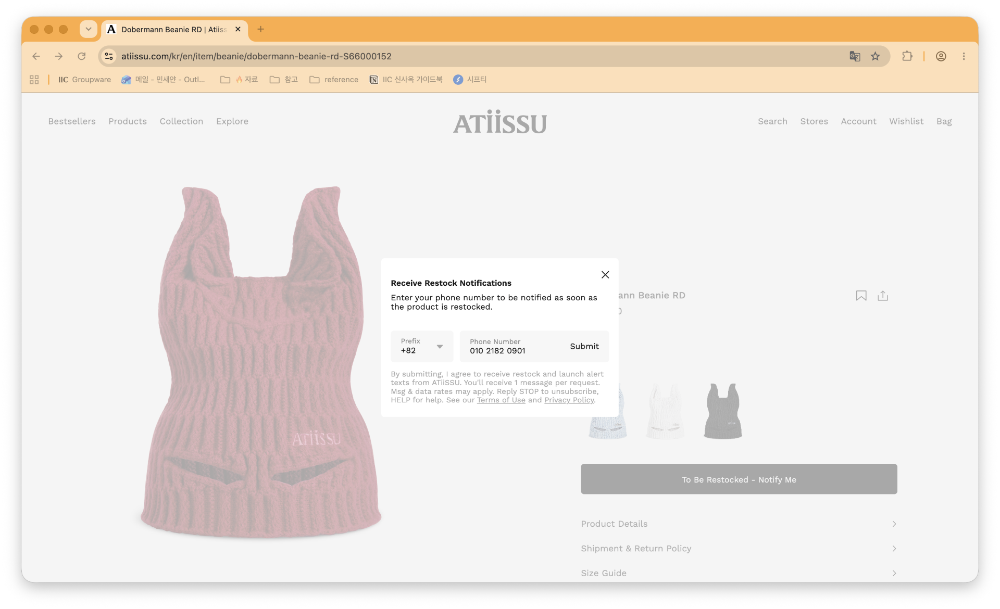

# ATiiSSU — SMS Opt-in Proof (Toll-Free Verification)

Public opt-in evidence for the ATiiSSU restock / launch SMS program operated by
IICOMBINED Co., Ltd.

## Opt-in screenshot

Direct image URL:
`https://raw.githubusercontent.com/SaeyanMin/atiissu-optin-proof/main/restock-optin.png`

## How customers opt in

1. Customer visits a product page on https://www.atiissu.com
2. The **"Receive Restock Notifications"** modal appears only for products that are
   out of stock / eligible for restock alerts, and only to **logged-in** users.
   (This is why the flow is not reachable from a public, logged-out page.)
   - Example product: https://www.atiissu.com/kr/en/item/beanie/dobermann-beanie-rd-S66000152
3. The customer enters their phone number (with country prefix) and taps **Submit**.
4. The consent text is shown directly below the phone field, before submission.

## Consent text shown at opt-in

> By submitting, I agree to receive restock and launch alert texts from ATiiSSU.
> You'll receive 1 message per request. Msg & data rates may apply.
> Reply STOP to unsubscribe, HELP for help. See our Terms of Use and Privacy Policy.

Includes: brand name, message frequency (1 message per request), message & data
rates notice, STOP/HELP instructions, and links to Terms of Use and Privacy Policy.

## Message frequency

One message per opt-in request — a single alert is sent when the requested item is
back in stock or newly launched.
